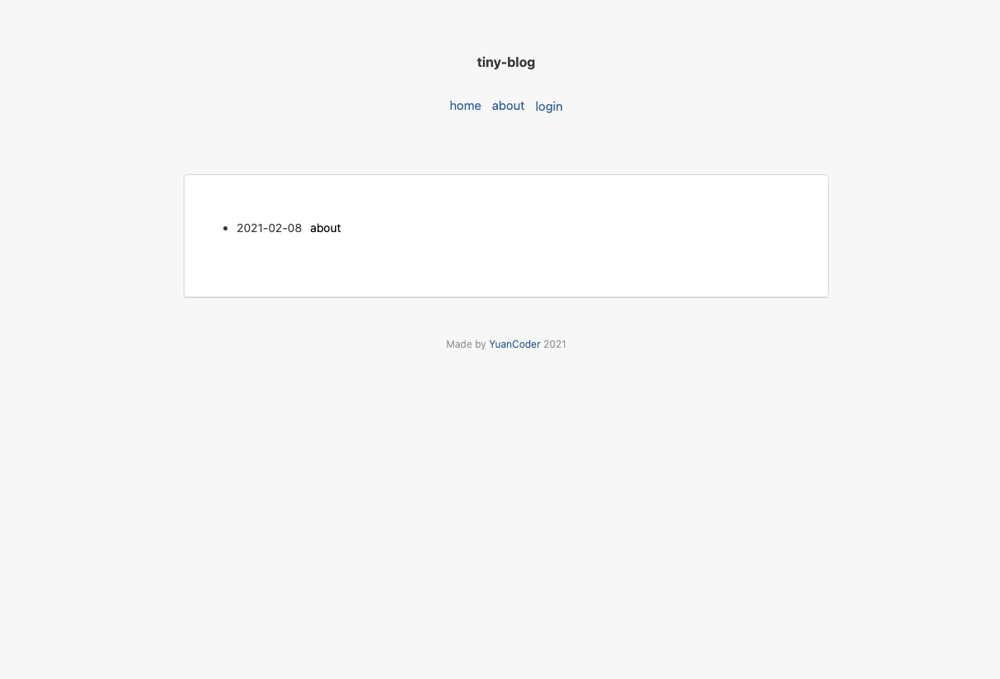

# tiny-blog

## package

- go get -u github.com/gin-gonic/gin
- go get -u github.com/spf13/viper
- go get -u github.com/sirupsen/logrus
- go get -u github.com/go-sql-driver/mysql
- go get -u github.com/lestrrat-go/file-rotatelogs
- go get -u github.com/rifflock/lfshook
- go get -u github.com/sirupsen/logrus
- go get -u github.com/russross/blackfriday/v2

## import sql

> sql/tiny-blog.sql

## config

> ./config.yaml

## run

```
go run main.go
```

## account

http://localhost:8086/login

username: tiny@blog.com
password: 123456

## preview



